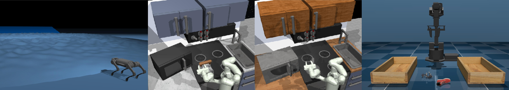

# D5RL



Offline reinforcement learning algorithms hold the promise of enabling data-driven RL methods that do not require costly or dangerous real-world exploration and benefit from large pre-collected datasets. This in turn can facilitate real-world applications, as well as a more standardized approach to RL research. Furthermore, offline RL methods can provide effective initializations for online finetuning to5
overcome challenges with exploration. However, evaluating progress on offline RL algorithms requires effective and challenging benchmarks that capture properties of real-world tasks, provide a range of task difficulties, and cover a range of challenges both in terms of the parameters of the domain (e.g., length of the horizon, sparsity of rewards) and the parameters of the data (e.g., narrow demonstration data or broad exploratory data). While considerable progress in offline RL in recent years has been enabled by simpler benchmark tasks, the most widely used datasets are increasingly saturating in performance and may fail to reflect properties of realistic tasks. We propose a new benchmark for offline RL that focuses on realistic simulations of robotic manipulation and locomotion environments, based on models
of real-world robotic systems, and comprising a variety of data sources, including scripted data, play-style data collected by human teleoperators, and other data sources. Our proposed benchmark covers state-based and image-based domains, and supports both offline RL and online fine-tuning evaluation, with some of the tasks specifically designed to require both pre-training and fine-tuning. We hope that our proposed benchmark will facilitate further progress on both offline RL and fine-tuning algorithms. 

## Installation

Run
```bash
conda create --name d5rl python=3.9
conda activate d5rl 

pip install --upgrade pip
pip install -r requirements.txt
pip install --upgrade "jax[cuda]" -f https://storage.googleapis.com/jax-releases/jax_releases.html  # Note: wheels only available on linux.
```

See instructions for other versions of CUDA [here](https://github.com/google/jax#pip-installation-gpu-cuda).

## Downloading the datasets

Download the Standard Franka Kitchen data with this command:
```bash
mkdir /PATH/TO/datasets/standard_kitchen
cd /PATH/TO/datasets/standard_kitchen
gsutil -m cp -r "gs://d5rl_datasets/KITCHEN_DATA/kitchen_demos_multitask_lexa_view_and_wrist_npz" .
```
Then set 
```bash
export STANDARD_KITCHEN_DATASETS=/PATH/TO/datasets/standard_kitchen/kitchen_demos_multitask_lexa_view_and_wrist_npz
```

Download the Randomized Franka Kitchen data with this command: 
```bash
mkdir /PATH/TO/datasets/randomized_kitchen
cd /PATH/TO/datasets/randomized_kitchen
gsutil -m cp -r "gs://d5rl_datasets/KITCHEN_DATA/expert_demos" .
gsutil -m cp -r "gs://d5rl_datasets/KITCHEN_DATA/play_data" .
```
Then set 
```bash
export KITCHEN_DATASETS=/PATH/TO/datasets/randomized_kitchen
```

Data download for the WidowX Sorting environments is handled internally in the environment code. 

Download the data for the A1 environments with these commands:
```bash
mkdir /PATH/TO/datasets/a1
cd /PATH/TO/datasets/a1
gsutil -m cp -r "gs://d5rl_datasets/a1/a1_extrapolate_above.zip" .
gsutil -m cp -r "gs://d5rl_datasets/a1/a1_hiking.zip" .
gsutil -m cp -r "gs://d5rl_datasets/a1/a1_interpolate.zip" .
```


## Running the experiments

To replicate the results from the paper, please see the following locations for examples of launching experiments

**Standard Kitchen Environment**: `./examples/kitchen_launch_scripts/standardkitchen`

**Randomized Kitchen Environment**: `./examples/kitchen_launch_scripts/randomizedkitchen`

**WidowX Sorting Environments**: `./examples/run_bc_widowx.sh`


<!-- ## Running the experiments

To replicate the results from the paper, please see the following examples:

### Standard Franka Kitchen 

The following shows how to launch IQL on the standard kitchen environment on the in-distribution evaluation tasks. See `./examples/kitchen_launch_scripts/standardkitchen` for a full list of examples for launching experiments on the standard kitchen environment.

```bash
cd ./examples
conda activate d5rl

unset LD_LIBRARY_PATH
unset LD_PRELOAD
export LD_LIBRARY_PATH=$LD_LIBRARY_PATH:~/.mujoco/mujoco210/bin
export LD_LIBRARY_PATH=$LD_LIBRARY_PATH:$CONDA_PREFIX/lib/
export LD_LIBRARY_PATH=$LD_LIBRARY_PATH:/usr/lib/nvidia-000
export LD_LIBRARY_PATH=$LD_LIBRARY_PATH:/usr/lib/nvidia
export MUJOCO_GL="egl"
export KITCHEN_DATASETS=/PATH/TO/datasets/randomized_kitchen
export STANDARD_KITCHEN_DATASETS=/PATH/TO/datasets/standard_kitchen/kitchen_demos_multitask_lexa_view_and_wrist_npz
export RELAY_POLICY_REPO="./benchmark/domains/relay-policy-learning/adept_envs"

XLA_PYTHON_CLIENT_PREALLOCATE=false python3 -u train_offline_pixels_kitchen.py \
--task "standardkitchen_indistribution" \
--tqdm=true \
--project test_standard_kitchen \
--algorithm iql \
--proprio=true \
--eval_episodes 50 \
--eval_interval 10_000 \
--online_eval_interval 10_000 \
--log_interval 1000 \
--max_gradient_steps 500_000 \
--max_online_gradient_steps 500_000 \
--replay_buffer_size 700_000 \
--batch_size 256 \
--im_size 64 \
--use_wrist_cam=false \
--camera_ids "12" \
--seed 0 
```


### Randomized Franka Kitchen 

The following shows how to launch IQL on the randomized kitchen environment on the in-distribution evaluation tasks using the expert-demo data. See `./examples/kitchen_launch_scripts/randomizedkitchen` for a full list of examples for launching experiments on the randomized kitchen environment.

```bash
cd ./examples
conda activate d5rl

unset LD_LIBRARY_PATH
unset LD_PRELOAD
export LD_LIBRARY_PATH=$LD_LIBRARY_PATH:~/.mujoco/mujoco210/bin
export LD_LIBRARY_PATH=$LD_LIBRARY_PATH:$CONDA_PREFIX/lib/
export LD_LIBRARY_PATH=$LD_LIBRARY_PATH:/usr/lib/nvidia-000
export LD_LIBRARY_PATH=$LD_LIBRARY_PATH:/usr/lib/nvidia
export MUJOCO_GL="egl"
export KITCHEN_DATASETS=/PATH/TO/datasets/randomized_kitchen
export STANDARD_KITCHEN_DATASETS=/PATH/TO/datasets/standard_kitchen/kitchen_demos_multitask_lexa_view_and_wrist_npz
export RELAY_POLICY_REPO="./benchmark/domains/relay-policy-learning/adept_envs"

XLA_PYTHON_CLIENT_PREALLOCATE=false python3 -u train_offline_pixels_randomizedkitchen.py \
--task "randomizedkitchen_indistribution-expert_demos" \
--tqdm=true \
--project bench_randomizedkitchen_debug3 \
--algorithm iql \
--proprio=true \
--eval_episodes 100 \
--eval_interval 50000 \
--online_eval_interval 50000 \
--log_interval 1000 \
--max_gradient_steps 500_000 \
--max_online_gradient_steps 500_000 \
--replay_buffer_size 400_000 \
--batch_size 256 \
--im_size 64 \
--use_wrist_cam=false \
--camera_ids "12" \
--seed 0 
```

### WidowX Sorting Environments

The script found in examples/run_bc_widowx.sh can be used to launch Imitation Learning on the WidowX task. 
```bash
cd ./examples
conda activate d5rl

unset LD_LIBRARY_PATH
unset LD_PRELOAD
export LD_LIBRARY_PATH=$LD_LIBRARY_PATH:~/.mujoco/mujoco210/bin
export LD_LIBRARY_PATH=$LD_LIBRARY_PATH:$CONDA_PREFIX/lib/
export LD_LIBRARY_PATH=$LD_LIBRARY_PATH:/usr/lib/nvidia-000
export LD_LIBRARY_PATH=$LD_LIBRARY_PATH:/usr/lib/nvidia
export MUJOCO_GL="egl"
export KITCHEN_DATASETS=/PATH/TO/datasets/randomized_kitchen
export STANDARD_KITCHEN_DATASETS=/PATH/TO/datasets/standard_kitchen/kitchen_demos_multitask_lexa_view_and_wrist_npz
export RELAY_POLICY_REPO="./benchmark/domains/relay-policy-learning/adept_envs"

datasets=(sorting sorting_pickplace)
actor_lrs=(0.0001)

for dataset in ${datasets[@]}; do
for actor_lr in ${actor_lrs[@]}; do
command="XLA_PYTHON_CLIENT_PREALLOCATE=false python3 examples/launch_train_widowx_bc.py \
--prefix $prefix \
--wandb_project ${proj_name} \
--batch_size 256 \
--encoder impala  \
--actor_lr $actor_lr \
--dataset $dataset \
--seed $seed \
--offline_finetuning_start -1 \
--online_start 10000000000000 \
--max_steps  10000000000000 \
--eval_interval 1000 \
--log_interval 1000 \
--eval_episodes 50 \
--checkpoint_interval 10000000000000"

echo $command

if [ $dry_run -eq 0 ]; then
    eval $command &
    sleep 100
fi

done
done
``` -->
